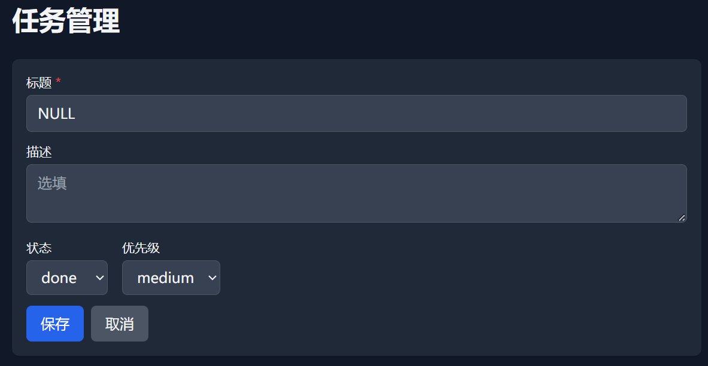
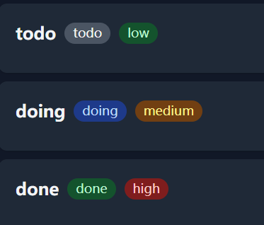
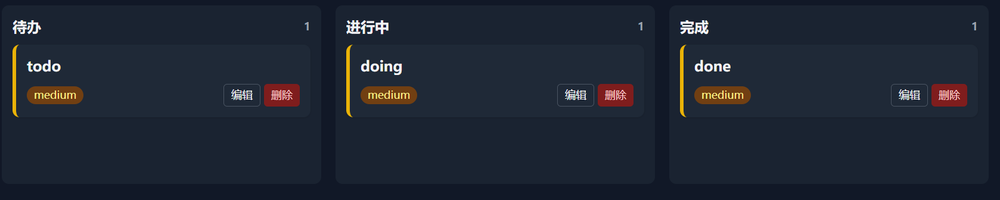
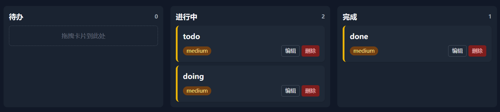
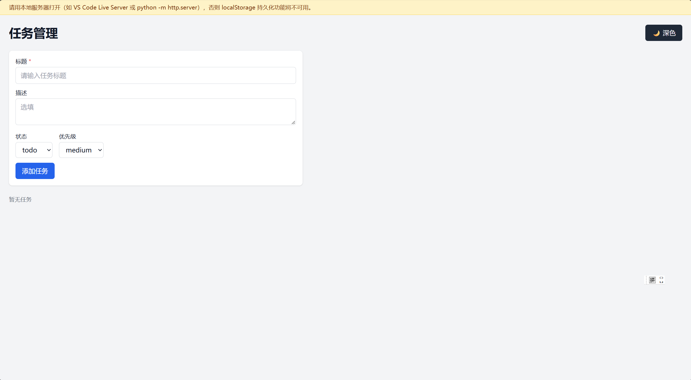
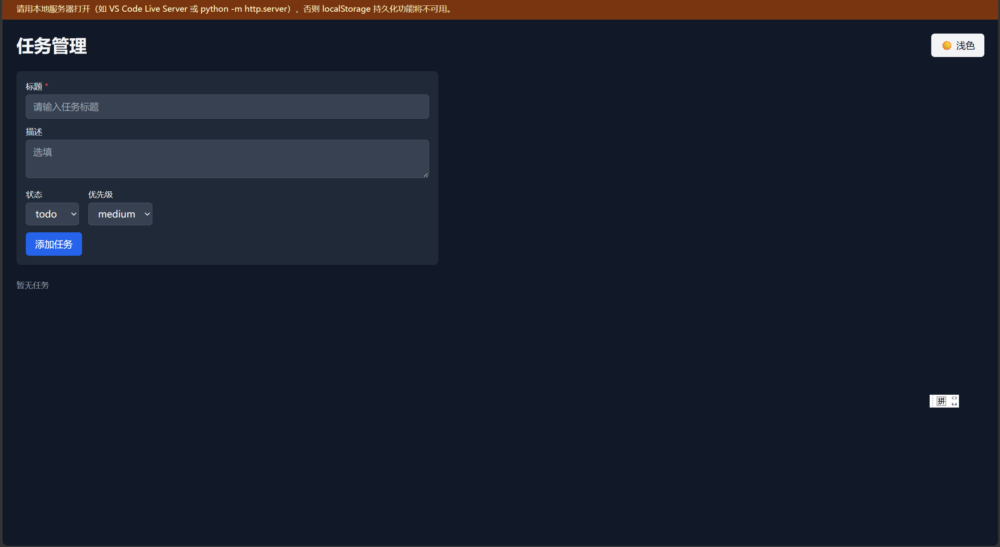

# 核心功能需求：

### 1.创建任务。其中任务标题必填，用红色*符号表示；描述选填，在描述部分的填写框中有默认提示。可选择当前任务状态: todo/doing/done，以及任务的优先级: low/medium/high

#### 其中，任务的不同状态和不同优先级，在显示上采用不同颜色：todo为灰色，doing为蓝色，done为绿色；low为绿色，medium为黄色，high为红色。

### 2.三列看板视图。依据任务的状态(todo/doing/done)，将所有任务在看板视觉上分为三栏，支持将任务从一栏拖拽到另一栏，实现任务状态的改变。

(拖拽改变任务状态)

### 3.支持切换深色/浅色模式。页面中有一个按钮，可以支持深色模式与浅色模式的切换。

###### (浅色模式)

###### (深色模式)

# Prmopt：
### 初始Prompt:浏览器控制台报了新的错误，是上一轮加 crossorigin 属性导致的，请直接编辑 index.html 修复：

错误内容：
Access to script at 'https://cdn.tailwindcss.com/' from origin 'null' has been blocked by CORS policy: No 'Access-Control-Allow-Origin' header is present on the requested resource.

原因分析：
Tailwind 的 CDN 服务端没有返回 Access-Control-Allow-Origin 响应头，
但上一轮给所有 CDN 标签加上了 crossorigin="anonymous"，
浏览器检查后发现响应头缺失，于是拦截了脚本加载。

修复要求：
1. 对 Vue 的 `<script>` 标签：保留 crossorigin="anonymous"（它需要这个属性来避免存储警告）。
2. 对 Tailwind 的 `<script>` 标签：移除 crossorigin="anonymous" 属性，改为普通引入。
3. 修改后确保页面能正常渲染，Vue 和 Tailwind 都能正常加载。

步骤：
1. 读取当前 index.html
2. 给出最小计划
3. 直接修改 index.html
4. 报告修改点和验证方法

不要提前实现其他功能。

我有一个任务管理应用要开发，项目根目录下已经有一个空的 index.html。

最终需求：
- 单文件 index.html
- Vue 3 CDN + Tailwind CSS CDN
- 任务增删改查：标题必填，描述选填
- 状态：todo / doing / done
- 优先级：high 红、medium 黄、low 绿
- 看板三列，拖拽改状态
- 深色模式，记住选择
- localStorage 持久化，刷新不丢

开发方式：
- 我们分多轮迭代，每轮只做一个行为。
- 每轮你都要直接编辑项目根目录下的 index.html 文件。
- 不要输出完整代码，只使用文件编辑工具修改文件。
- 每轮先读取当前 index.html，再说明最小计划，然后直接修改。
- 修改后告诉我改了哪些部分，以及如何在浏览器验证。
- 我会在浏览器中验证，再把结果反馈给你。

请确认你理解这个开发方式，不要修改任何文件。

第一轮：
第 1 轮：只做项目骨架。

请直接编辑项目根目录下的 index.html，不要输出完整代码。

要求：
- 引入 Vue 3 CDN 和 Tailwind CSS CDN
- 页面显示标题“任务管理”
- 页面能正常打开，无控制台报错
- 不实现任务 CRUD、看板、拖拽、localStorage、深色模式

步骤：
1. 先读取当前 index.html
2. 给出本轮最小计划
3. 直接使用文件编辑工具修改 index.html
4. 只报告修改了哪些部分，以及验证方法

### 第一轮agent生成完成后，经过本地的浏览器测试，在F12的控制台中发现了一些警告和错误，分析原因后，生成修改的Prompt:
浏览器控制台报了以下问题，请直接编辑项目根目录下的 index.html 修复：

1. 跟踪预防警告：Tracking Prevention blocked access to storage for https://unpkg.com/vue@3...
   请给所有 CDN 的 `<script>` 标签加上 crossorigin="anonymous" 属性。

2. file:// 协议错误：Unsafe attempt to load URL file://...
   这是浏览器对 file:// 页面的安全限制。
   请在页面顶部加一个提示条，告诉用户：
   "请用本地服务器打开（如 VS Code Live Server 或 python -m http.server），
   否则 localStorage 持久化功能将不可用。"

3. Tailwind CDN 警告是官方设计，不用修，保留即可。

步骤：先读取 index.html → 给最小计划 → 直接修改 → 报告修改点。

### 第二次修改：
浏览器控制台报了新的错误，是上一轮加 crossorigin 属性导致的，请直接编辑 index.html 修复：

错误内容：
Access to script at 'https://cdn.tailwindcss.com/' from origin 'null' has been blocked by CORS policy: No 'Access-Control-Allow-Origin' header is present on the requested resource.

原因分析：
Tailwind 的 CDN 服务端没有返回 Access-Control-Allow-Origin 响应头，
但上一轮给所有 CDN 标签加上了 crossorigin="anonymous"，
浏览器检查后发现响应头缺失，于是拦截了脚本加载。

修复要求：
1. 对 Vue 的 `<script>` 标签：保留 crossorigin="anonymous"（它需要这个属性来避免存储警告）。
2. 对 Tailwind 的 `<script>` 标签：移除 crossorigin="anonymous" 属性，改为普通引入。
3. 修改后确保页面能正常渲染，Vue 和 Tailwind 都能正常加载。

步骤：
1. 读取当前 index.html
2. 给出最小计划
3. 直接修改 index.html
4. 报告修改点和验证方法

不要提前实现其他功能。

### 第二轮：
第 2 轮：只做深色模式。

请直接编辑项目根目录下的 index.html，不要输出完整代码。

要求：
- 一个按钮切换深色/浅色
- 使用 Tailwind dark: 类
- 用 localStorage 记住选择
- 刷新后主题保持
- 不要提前实现任务 CRUD、看板、拖拽

步骤：
1. 读取当前 index.html
2. 给出最小计划
3. 直接修改 index.html
4. 报告修改点和验证方法

### 第三轮
第 3 轮：只做任务增删改查。

请直接编辑项目根目录下的 index.html，不要输出完整代码。

要求：
- 表单：标题必填，描述选填
- 状态：todo / doing / done
- 优先级：high / medium / low
- 列表展示任务
- 标题为空时禁止提交并提示
- 不要提前做看板、拖拽、持久化

步骤：先读取 → 给计划 → 直接修改 → 报告修改点和验证方法。

### 第四轮：
第 4 轮：只做 localStorage 持久化。

请直接编辑项目根目录下的 index.html，不要输出完整代码。

要求：
- 任务列表保存到 localStorage
- 刷新后任务不丢失
- 不要提前做看板、拖拽

步骤：先读取 → 给计划 → 直接修改 → 报告修改点和验证方法。

### 第五轮：
第 5 轮：把列表改成看板视图。

请直接编辑项目根目录下的 index.html，不要输出完整代码。

要求：
- 三列：待办 / 进行中 / 完成
- 卡片显示标题、描述、优先级颜色：高红、中黄、低绿
- 支持 HTML5 拖拽卡片到另一列改状态
- 拖拽后持久化

步骤：先读取 → 给计划 → 直接修改 → 报告修改点和验证方法。

### 最终Prompt：
第 6 轮：总验收。

请直接编辑项目根目录下的 index.html，不要输出完整代码。

按以下清单检查并修复：
- 新增任务，标题必填
- 编辑、删除
- 状态三档
- 优先级三色
- 看板三列
- 拖拽改状态
- 深色模式记住选择
- 刷新不丢数据

步骤：先读取 → 列出问题 → 直接修改 → 报告修改点和最终验证方法。